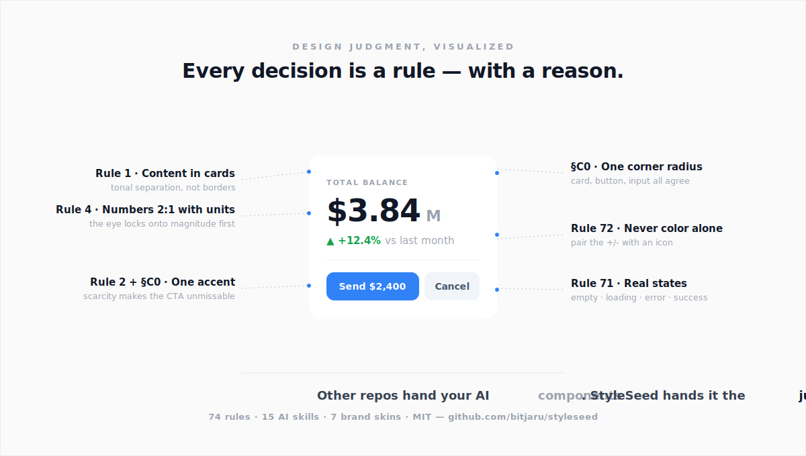

<div align="center">

<br />

# styleseed

### Claude Code · Cursor · 바이브코딩을 위한 디자인 시스템

<br />

<a href="https://styleseed-demo.vercel.app">
  
</a>

<br /><br />

[](https://styleseed-demo.vercel.app)
&nbsp;
[](https://styleseed-demo.vercel.app/pricing)

**같은 컴포넌트. 3개 브랜드 DNA.** Toss · Raycast · Arc — 색감·라운드·모션·그림자·그라데이션이 전부 StyleSeed 토큰으로 morph. 코드 분기 없이 `data-skin` 속성 하나로.

<br />

**다른 repo는 LLM한테 브랜드가 어떻게 생겼는지 가르칩니다. StyleSeed는 디자이너가 어떻게 생각하는지 가르칩니다.**<br />
Data vs Judgment. 74개 디자인 룰을 Claude Code·Codex·Cursor가 자동으로 읽어요. 결과물이 "생성된 것" 처럼 안 보이고 "디자인된 것" 처럼 나옵니다.

<br />

<a href="https://styleseed-demo.vercel.app/how-it-thinks">
  
</a>

<br /><br />

[사용법](#사용법) · [왜-필요한가](#왜-필요한가) · [모션](#네임드-모션-시스템) · [AI-스킬-15개](#ai-스킬-15개) · [Wiki](../../wiki)

<br />

</div>

---

## 누구를 위한 프로젝트인가?

- **Claude Code**나 **Cursor**에 대시보드를 시켰는데 촌스럽게 나오신 분
- **바이브코딩**으로 SaaS를 만드는데 디자이너를 구하기 어려우신 분
- **shadcn/ui**를 쓰지만 결과물이 여전히 "AI가 만든 느낌"이신 분
- **토스 스타일**의 정제된 UI를 원하지만 직접 역설계하기 힘드신 분
- 디자인용 **Claude Code 스킬** 또는 **Cursor rules**를 만드시는 분
- AI로 빠르게 출시하면서도 "AI로 만든 티 안 나는" UI가 필요하신 분

## Data vs Judgment

"LLM 디자인 개선" 시도하는 repo들은 전부 문제의 절반만 풀고 있어요. 모델한테 **디자인 데이터**를 더 먹이는 방식이죠. 브랜드 팔레트. 폰트 스펙. Shadow 토큰. 컴포넌트 라이브러리. 저도 그렇게 시작했습니다. Toss 디자인 토큰 JSON 통째로 프롬프트에 박아넣어 봤는데, 결과물은 여전히 촌스러웠어요.

그때 깨달았습니다. **Toss 팔레트 쥐여준 주니어 디자이너도 여전히 촌스러운 대시보드 만듭니다. 회색만 있는 시니어 디자이너는 정제된 화면 뽑아냅니다.** 차이는 가진 게 아니에요. 그걸 가지고 뭘 해야 할지 아는 것입니다.

디자인 데이터는 물감이에요. 디자인 판단은 물감을 어디에 칠해야 할지 아는 겁니다.

StyleSeed는 **디자인 엔진**입니다. 74개 시각 룰, 48개 컴포넌트, 네임드 모션 시스템, 15개 슬래시 커맨드가 LLM에게 데이터가 아니라 판단을 가르칩니다:

```
"정제된 검정은 #000이 아니라 #2A2A2A다"
"한 앱에 강조색은 딱 하나, 나머지는 회색. 절제가 우아함이다"
"그림자는 4% 투명도. 보이면 이미 너무 진한 거다"
"숫자와 단위는 2:1 비율. 48px 숫자, 24px 단위. 항상"
"같은 섹션 타입을 연속으로 쓰지 말 것. 높이 / 낮이 번갈아서 리듬을 만들 것"
"카드와 배경의 분리가 어떤 테두리보다 중요하다"
```

이런 룰은 아무도 안 써놓습니다. 프로 디자이너의 수년 경험에 녹아있어서 외부인한테 안 보이고, 그래서 LLM한테도 안 보입니다. StyleSeed는 이걸 써놓고, 6개 카테고리 (컬러 규율, 공간 리듬, 정보 위계, 그림자/elevation, 컴포넌트 변주, 모션/피드백) 로 정리해서 마크다운 한 파일로 Claude한테 건네줍니다.

룰은 **브랜드 독립적**이에요. 특정 색을 언급하지 않고 시맨틱 토큰만 참조합니다. 그래서 같은 룰셋이 Toss든 Vercel이든 클라이언트의 이상한 퍼플 브랜드든 똑같이 작동해요. 스킨을 바꿔도 판단은 그대로 유지됩니다.

## 30초 실증

Claude Code한테 "대시보드 만들어줘" 하면 보통 이런 결과가 나옵니다:

> 간격 제각각, 폰트 크기 뒤죽박죽, 색 남발, 카드 구조 없음. 기능은 되는데 촌스러움.

**StyleSeed를 쓰면:**

<div align="center">
  
  <br />
  <em>Claude Code + Toss seed로 생성. 디자이너 개입 0.</em>
</div>

<details>
<summary><strong>전체 페이지 보기</strong></summary>
<div align="center">
  
</div>
</details>

<br />

차이점? AI한테 **디자이너의 판단 기준**을 심어준 것.

**[before/after 직접 보기 →](https://styleseed-demo.vercel.app/why)** — 같은 대시보드 브리프를, 일반 AI 출력 vs 69룰 적용으로 나란히. 각 차이가 어떤 룰 때문인지 주석까지.

## 사용법

### ⚡ 가장 빠른 방법: 한 문장 붙여넣기

Claude Code·Codex·Cursor 등 아무 AI 에이전트에 이 한 문장을 붙여넣으면 끝 — 설치 불필요:

```
Read https://styleseed-demo.vercel.app/llms-full.txt and apply StyleSeed's design rules to every UI in this project. First, in plan mode, lock my key color and motion style with me — then build to the rules and self-check coherence (one accent, one radius) after.
```

> 💡 **디자인이 제멋대로 나오면** 거의 항상 "제약 부족"이 원인입니다. 플랜모드로 **키 컬러·모션을 먼저 정하고**, 룰 파일(`CLAUDE.md`/`AGENTS.md`)을 프로젝트에 **설치**하면(매 프롬프트 재참조) 일관성이 확 올라갑니다.

설치형이 좋으면 `npx skills add bitjaru/styleseed` → `/ss-setup`. 기존 프로젝트에 직접 넣으려면 아래 방법을 쓰세요.

### 방법 1: 인터랙티브 설정 (추천)

**1단계 — 스킬 먼저 복사.** 프로젝트 루트 폴더에서 (Claude Code가 아니라 터미널에서) 실행하세요:

```bash
# StyleSeed 다운로드
git clone https://github.com/bitjaru/styleseed.git /tmp/styleseed

# 슬래시 스킬을 프로젝트에 복사 (.claude/skills 를 명시적으로 복사 —
# `cp -r engine/*` 는 숨김 폴더를 건너뛰어서 /ss-setup 이 안 보이는 원인)
mkdir -p .claude/skills
cp -r /tmp/styleseed/engine/.claude/skills/* .claude/skills/
```

**2단계 — Claude Code 재시작** (스킬은 시작할 때 로드됨) 후 실행:

```
/ss-setup
```

그러면 Claude Code가 하나씩 물어봅니다:
1. 어떤 앱? (SaaS, 이커머스, 핀테크...)
2. 브랜드 색상? (선택 또는 헥스 코드 입력)
3. 참고할 브랜드 스타일? (Stripe, Linear, Vercel... awesome-design-md에서 선택)
4. 폰트?
5. 앱 이름 + 첫 페이지?

자동으로 설정하고 첫 페이지까지 생성해줍니다.

### 방법 2: Claude Code한테 URL 주기

```
https://github.com/bitjaru/styleseed 여기에서 engine/CLAUDE.md 랑
engine/DESIGN-LANGUAGE.md 읽고 디자인 시스템 규칙 파악해줘.
engine/components/ 컴포넌트랑 skins/stripe/theme.css 토큰 사용해서
SaaS 대시보드 만들어줘. 매출 차트, 유저 통계, 최근 활동 포함.
```

Claude Code가 디자인 규칙을 읽고 적용합니다. 설치 필요 없음.

### 방법 3: 프로젝트에 복사 (계속 쓸 때)

```bash
git clone https://github.com/bitjaru/styleseed.git /tmp/styleseed
# 엔진 복사 (방법 1의 스킬 복사도 함께 진행)
cp /tmp/styleseed/engine/CLAUDE.md ./CLAUDE.md
cp /tmp/styleseed/engine/DESIGN-LANGUAGE.md ./.claude/DESIGN-LANGUAGE.md
cp -r /tmp/styleseed/engine/components/* src/components/
cp -r /tmp/styleseed/engine/css/* src/styles/
cp /tmp/styleseed/skins/toss/theme.css src/styles/theme.css
```

`CLAUDE.md`를 자동으로 읽어서 매번 URL 안 줘도 됩니다.

## 왜 필요한가

### 모두가 겪는 문제

AI 코딩 도구는 기능적인 UI를 잘 만듭니다. 하지만 **기능적 ≠ 아름다운**.

디자인 규칙 없이 AI가 만든 UI:
- 간격이 제각각 (여기 16px, 저기 20px, 또 14px)
- 타이포그래피 계층 없음 (폰트 크기/두께 뒤죽박죽)
- 시각적 리듬 없음 (카드가 다 똑같음)
- 색 남용 (컬러가 너무 많거나 대비가 안 맞음)

**디자이너를 고용하거나... StyleSeed를 쓰거나.**

### StyleSeed이 다른 점

토큰만 주는 게 아닙니다. AI한테 **디자인 감각** 자체를 심어줍니다:

| 레이어 | 역할 |
|--------|------|
| **디자인 언어** | 구체적 시각 규칙 — 컬러 철학, 숫자 비율, 카드 구조, 페이지 구성, 금지 패턴 |
| **디자인 토큰** | 색상, 타이포, 간격, 그림자, 모션, 테두리 — 라이트 & 다크 모드 |
| **CSS 테마** | Tailwind CSS v4 구현체 |
| **컴포넌트** | UI 프리미티브 32개 + 패턴 컴포넌트 16개 |
| **모션** | 네임드 시드 5종 + 복사-붙여넣기 키워드 라이브러리 |
| **AI 스킬** | Claude Code 슬래시 명령어 15개 |

### 이런 규칙이 차이를 만듭니다

```
규칙: 숫자는 항상 크게, 단위는 항상 작게 — 2:1 비율.
      48px 숫자 + 24px 단위. 같은 크기 금지.

규칙: 앱 전체에서 강조 색상은 딱 하나. 나머지는 전부 회색.
      강조 색은 활성/선택 상태에만 사용.

규칙: 순수 검정(#000) 절대 금지. 가장 어두운 색은 #2A2A2A.
      5단계 그레이: #2A → #3C → #6A → #7A → #9B

규칙: 모든 콘텐츠는 카드 안에. 페이지 배경에 직접 배치 금지.
      카드(#FFF)와 배경(#FAFAFA)의 차이가 자연스러운 구분선.

규칙: 같은 섹션 타입을 연속으로 반복 금지.
      높은 섹션과 낮은 섹션을 교대해서 시각적 리듬 만들기.

규칙: 카드 그림자는 겨우 보일 정도 (opacity 4-8%).
      그림자가 눈에 확 띄면 너무 강한 거.
```

이건 수십 개 규칙 중 6개. [전체 디자인 언어 보기 →](engine/DESIGN-LANGUAGE.md)

## AI 스킬 15개

스킬을 복사하면 **슬래시 명령어 15개**를 쓸 수 있습니다 — 설정 · UI · 모션 · UX:

### UI 스킬 — 잘 만들기

| 스킬 | 기능 |
|------|------|
| `/ss-component` | 디자인 규칙에 맞는 새 컴포넌트 생성 |
| `/ss-page` | 모바일 페이지 스캐폴딩 |
| `/ss-pattern` | UI 패턴 조합 (카드 그리드, 테이블, 차트) |
| `/ss-motion` | 네임드 모션 적용 — 시드 또는 키워드 무브 (`toggle-flip`, `tilt-3d`...) |
| `/ss-review` | 디자인 시스템 위반 감사 |
| `/ss-tokens` | 디자인 토큰 조회/추가/수정 |
| `/ss-a11y` | 접근성 감사 (WCAG 2.2 AA) |
| `/ss-lint` | 빠른 자동 린트 — 흔한 위반을 수초 안에 감지 |
| `/ss-score` | UI 디자인 품질 0-100 점수 + 우선순위 수정 목록 |
| `/ss-update` | 최신 엔진 업데이트 — 프로젝트 분석 후 안전하게 갱신 |

### UX 스킬 — 잘 설계하기 (디자이너 없이)

| 스킬 | 기능 |
|------|------|
| `/ss-flow` | 유저 플로우 설계 (점진적 공개, 정보 피라미드) |
| `/ss-audit` | 닐슨 10대 사용성 원칙으로 UX 평가 |
| `/ss-copy` | UX 마이크로카피 생성 (버튼, 에러, 빈 상태, 토스트) |
| `/ss-feedback` | 4가지 피드백 상태 추가 (로딩, 빈 상태, 에러, 성공) |

### 워크플로우 예시

```bash
# 1. 플로우 설계
> /ss-flow "이메일 인증 포함 온보딩"

# 2. 페이지 생성
> /ss-page Onboarding "3단계 온보딩: 이름, 이메일 인증, 설정"

# 3. UX 카피 생성
> /ss-copy "온보딩 — 버튼 라벨, 에러 메시지, 성공 상태"

# 4. 피드백 상태 추가
> /ss-feedback src/pages/Onboarding.tsx

# 5. 전체 검토
> /ss-audit src/pages/Onboarding.tsx
> /ss-review src/pages/Onboarding.tsx
```

결과: 디자이너 없이 만든, 전문적이고 접근성 좋은 온보딩 플로우.

## StyleSeed + awesome-design-md

[awesome-design-md](https://github.com/VoltAgent/awesome-design-md)는 AI가 읽는 DESIGN.md 파일 모음입니다. **우리는 이것 위에 더 깊이 갑니다.**

| | DESIGN.md | StyleSeed |
|---|-----------|-----------|
| **역할** | 브랜드 토큰 (피부) | 디자인 감각 (뇌) |
| **AI에게 가르치는 것** | 어떤 색/폰트를 쓸지 | 어떻게 디자이너처럼 생각할지 |
| **컴포넌트** | 없음 | 48개 |
| **AI 스킬** | 없음 | 15개 |
| **레이아웃 규칙** | 없음 | 섹션 타입, 정보 피라미드, 시각적 리듬 |
| **금지 패턴** | 없음 | 수십 개의 "이러면 안 됨" 규칙 |

**같이 쓰면 시너지:**

```bash
# Stripe의 브랜드 스킨 + StyleSeed 디자인 규칙
cp -r /tmp/styleseed/engine/.claude/skills/* .claude/skills/
cp /tmp/styleseed/skins/stripe/theme.css src/styles/theme.css
```

## 네임드 모션 시스템

AI가 만드는 모션은 대부분 똑같은 기본 페이드입니다. StyleSeed는 모션에 **어휘**를 줍니다 — 느낌에 이름을 붙여서, 모든 페이지에 일관된 의도적 애니메이션을 적용합니다. 두 레이어:

**1. 시드 = 성격.** 5개의 네임드 프리셋 (Spring 통통 · Silk 부드러움 · Snap 즉각 · Float 부유 · Pulse 박동), 각각 `entrance`/`exit`/`hover`/`press`/`layout` 5개 컨텍스트의 framer-motion 레시피.

```tsx
import { spring } from "@engine/motion";

<motion.button {...spring.hover} {...spring.press}>저장</motion.button>
```

**2. 키워드 = 독창적 무브.** 이름 하나로 호출하는 복사-붙여넣기 모션 라이브러리 — `toggle-flip`, `reveal-blur`, `tilt-3d`, `magnetic`, `glow-pulse`, `confetti-pop` 등. 바이브코딩 중에 키워드를 말하거나 (`/ss-motion toggle-flip`) 하면 같은 레시피가 코드에 들어갑니다.

▶ **[라이브 갤러리에서 모든 모션 미리보기 & 복사 →](https://styleseed-demo.vercel.app/motion)**
&nbsp;·&nbsp; [직접 만들기 → 모션 가이드](https://styleseed-demo.vercel.app/motion/guide)

## 사용 가능한 스킨

| 스킨 | 스타일 |
|------|--------|
| **[toss](skins/toss/)** | 토스 스타일 모바일 핀테크 — 퍼플, 미니멀 |
| **[stripe](skins/stripe/)** | 프로페셔널 — 인디고, 멀티 레이어 섀도우 |
| **[linear](skins/linear/)** | 다크 우선 — 바이올렛, 개발자 지향 |
| **[notion / raycast / arc / vercel](skins/)** | 그 외 내장 스킨 |
| **[58+ 더보기](skins/_from-awesome-design-md/)** | awesome-design-md의 모든 브랜드 (`/ss-setup`로 자동 변환) |

## StyleSeed vs 대안

| | StyleSeed | shadcn/ui | Tailwind UI | Material UI | AI 기본 결과물 |
|---|---|---|---|---|---|
| 컴포넌트 | ✅ 48개 | ✅ 50+ | ✅ | ✅ | ❌ |
| 디자인 **판단 기준** (언제 뭘 쓸지) | ✅ 74개 룰 | ❌ | ❌ | 일부 | ❌ |
| Claude Code / Cursor 통합 | ✅ 15개 스킬 | ❌ | ❌ | ❌ | — |
| 브랜드 스킨 (Toss, Stripe, Linear...) | ✅ | ❌ | ❌ | ❌ | ❌ |
| 가격 | 무료 (MIT) | 무료 | $299+ | 무료 | — |
| AI 코딩툴과 *함께* 동작 | ✅ | 간접 | 간접 | 간접 | — |

**요약:** shadcn/ui는 컴포넌트를 줍니다. Tailwind UI는 템플릿을 줍니다. StyleSeed는 **AI 결과물이 AI 같아 보이지 않게 만드는 디자인 판단 기준**을 줍니다.

## 자주 묻는 질문

**Q: Claude Code / Cursor가 왜 촌스러운 UI를 만드나요?**
LLM은 기능적 정답을 최적화하지 시각적 세련도를 최적화하지 않습니다. `#000` 검정, `py-4` 간격, 전부 `text-xl` — 문법은 맞고 결과는 아마추어. StyleSeed는 프로 디자이너가 쓰는 기준을 LLM에게 줍니다.

**Q: shadcn/ui 대체재인가요?**
아니요. shadcn/ui 패턴 **위에** 얹는 도구입니다. 같은 Radix primitive, 같은 CVA 컨벤션을 씁니다. "shadcn/ui + 디자인 판단 + AI 툴 통합" 이라고 생각하시면 됩니다.

**Q: Cursor에서도 되나요?**
됩니다. 74개 룰이 `.cursorrules`와 `CLAUDE.md`에 들어있어서 Cursor가 자동으로 읽습니다.

**Q: awesome-design-md와 뭐가 다른가요?**
awesome-design-md는 브랜드별 DESIGN.md를 줍니다 (what). StyleSeed는 그 브랜드를 실제 동작하는 앱으로 바꾸는 엔진을 줍니다 (how). 함께 쓰면 시너지.

**Q: 핀테크 아닌 앱에도 쓸 수 있나요?**
네. 엔진은 브랜드 중립적입니다. 스킨을 고르고 브랜드 색만 바꾸면 됩니다.

## 문서

상세 문서는 **[Wiki](../../wiki)**에 있습니다 — 디자인 규칙, 페이지 구성 레시피, 차트 가이드 등.

## 기여하기

StyleSeed는 **살아있는 판단 프레임워크**입니다 — 룰은 고정된 게 아니에요. 써보다가 "이렇게 하면 확실히 더 낫다"는 패턴을 찾으면, 룰로 제안해서 모두의 AI에게 가르치세요.

### ⭐ 디자인 룰 제안하기 (핵심)

좋은 룰은 의견이 아니라 **결정 + 그게 잘되는 이유**를, 모델이 적용할 수 있게 적은 것입니다.

```markdown
**Rule:** 숫자는 단위와 2:1 (48px 값 위에 24px 단위).
**Why it works:** 눈이 크기=중요도를 먼저 잠금. 같은 크기면 값이 납작해져 위계가 사라짐.
**Source:** Refactoring UI.
```

**["디자인 룰 제안"](https://github.com/bitjaru/styleseed/issues/new?template=design_rule.yml)** 이슈를 열거나, `engine/DESIGN-LANGUAGE.md`(시각/레이아웃) 또는 `engine/VISUAL-CRAFT.md`(크래프트·정합성)에 PR하세요. 판단 기준은 커뮤니티가 쌓을수록 복리로 좋아집니다.

### Claude Code로 새 스킨 만들기

1. `mkdir skins/your-brand`
2. `cp skins/toss/theme.css skins/your-brand/theme.css`
3. Claude에게: *"`skins/toss/theme.css`를 참고해서 [Linear / Apple / Material] 스타일 스킨 만들어줘 — `--brand` 색상과 토큰을 바꿔서"*
4. PR 제출

자세한 내용은 [CONTRIBUTING.md](CONTRIBUTING.md)를 참고하세요.

## 라이선스

[MIT](LICENSE)
