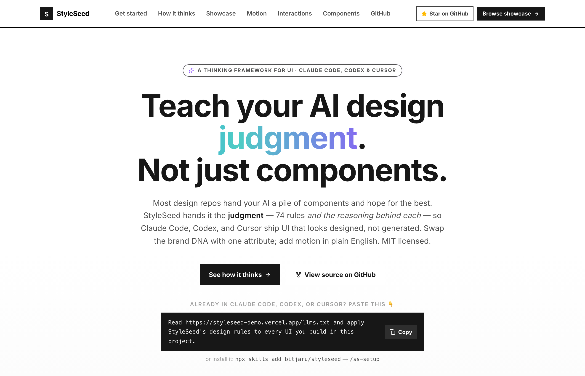
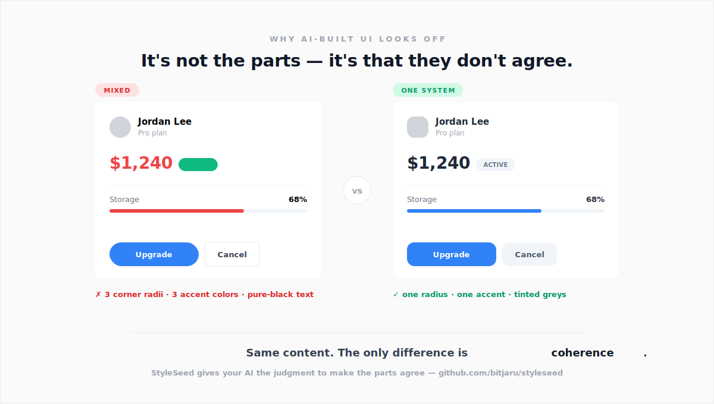
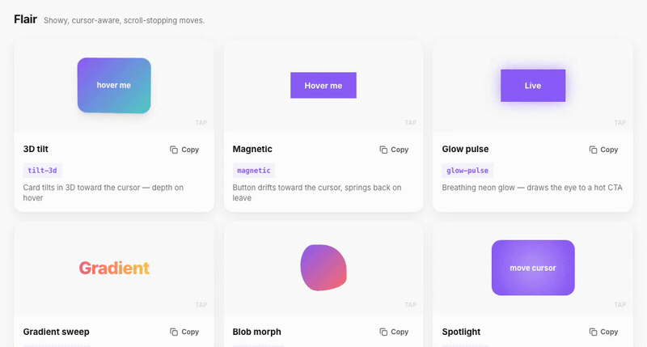

<div align="center">

<br />

# StyleSeed

### The design engine for Claude Code, Codex, Cursor, and vibe coding.

<br />

<a href="https://styleseed-demo.vercel.app">
  
</a>

<br /><br />

[](https://styleseed-demo.vercel.app)
&nbsp;
[](https://styleseed-demo.vercel.app/motion)
&nbsp;
[](https://styleseed-demo.vercel.app/pricing)

<br /><br />

[](https://github.com/maxbogo/awesome-ai-tools-for-ui)

<br />

<a href="https://styleseed-demo.vercel.app">
  
</a>

**One component. Three brand DNAs.** Same chat UI morphing across Toss · Raycast · Arc — colors, radius, motion, shadows, gradients all driven by StyleSeed tokens. No rewrites. No conditional code. Just a `data-skin` attribute.

<br />


[](https://github.com/bitjaru/styleseed/stargazers)
[](https://github.com/bitjaru/styleseed/blob/main/LICENSE)
[](https://oosmetrics.com/repo/bitjaru/styleseed)

**Other repos teach LLMs what brands look like. StyleSeed teaches LLMs how designers think.**<br />
Data vs judgment. 74 design rules that Claude Code, Codex, and Cursor read automatically — so the output stops looking generated and starts looking designed.

<br />

<a href="https://styleseed-demo.vercel.app/how-it-thinks">
  
</a>

<br /><br />

[Get Started](#get-started) · [Engine + Skins](#how-it-works-engine--skins) · [Motion](#named-motion-system) · [Skills](#15-ai-powered-skills) · [Wiki](../../wiki) · [한국어](README-KR.md)

<br />

</div>

---

## Get started in 30 seconds

**The fastest way — paste this one sentence** into Claude Code, Codex, Cursor, or any AI agent. No install:

```
Read https://styleseed-demo.vercel.app/llms-full.txt and apply StyleSeed's design rules to every UI in this project. First, in plan mode, lock my key color and motion style with me. Then build to the rules, and before showing me anything run StyleSeed's quality gate (one accent, one radius, normal states grey not rainbow, real empty/error states) and fix what fails.
```

That's it — the agent plans the design with you, locks a key color, then applies the rules to whatever you build next. (Planning first is what keeps the result from looking random — see [Troubleshooting](#troubleshooting--i-applied-styleseed-but-the-ui-still-looks-bad).) Works with **Claude Code (`CLAUDE.md`), Codex / Amp / Gemini CLI (`AGENTS.md`), and Cursor (`.cursorrules`)** — StyleSeed ships all three, so any agent picks the rules up automatically.

**What your agent actually does with StyleSeed loaded:**

```text
you    ▸  build me a billing settings page
agent  ▸  (plan mode) key color? I'd use one indigo accent — #5E6AD2 (SaaS). Motion: Snap. ok?  ▸ y
agent  ▸  ✓ wrote STYLESEED.md — skin, accent, radius, motion locked, re-read every prompt
agent  ▸  building… running the quality gate before I show you anything
gate   ▸  ✗ two accent colors   ✗ "normal" rows colored   ✗ no empty state   → fixing
agent  ▸  ✓ 88/100 — one accent, grey normal states, real empty/error states. here's the page.
```

**The `STYLESEED.md` lock is the anti-drift mechanic.** Your skin, key color, radius, and motion get written once and the rules make every agent re-read and obey them on *every* prompt — so the design stops being different each session. The [Quality Gate](#troubleshooting--i-applied-styleseed-but-the-ui-still-looks-bad) then self-reviews and fixes the UI (rainbow lists, two accents, missing states) *before* you ever see it.

> **The rules are the product — and they need zero install or permissions.** They're
> plain markdown (`CLAUDE.md` / `AGENTS.md` / `DESIGN-LANGUAGE.md`), so the prompt above —
> or just copying those files in — is 90% of StyleSeed with nothing to approve.

**Want the `/ss-*` slash-command skills too** (optional automation: setup wizard, review, score)?

```bash
npx skills add bitjaru/styleseed
```
This installs all 15 skills **universally** (Claude Code, Codex, Cursor, Gemini CLI, Amp + 12 more), then run `/ss-setup`. The skills are a real upgrade — a setup wizard, `/ss-review` and `/ss-score` to grade your UI, scaffolding, motion — so installing them is worth it. Because skills are *executable*, your agent asks you to **approve them once on first use** — that's normal for any third-party skill (good security), a quick one-time step, not a StyleSeed block. (And if you can't install them in your setup, the rules alone still do the core work.)

**Your agent, its exact path:**

| Your agent | Reads | Fastest install |
|---|---|---|
| **Claude Code** | `CLAUDE.md` + `/ss-*` skills | `npx skills add bitjaru/styleseed` |
| **Cursor** | `.cursorrules` | `cp engine/.cursorrules .cursorrules` — or paste the prompt above |
| **Codex · Amp · Gemini CLI** | `AGENTS.md` + skills | `npx skills add bitjaru/styleseed` |
| **Windsurf · Copilot · any other** | the paste-prompt above | no install — paste & go |

<sub>More paths (manual copy, Cursor, awesome-design-md brands) in [Get Started](#get-started) below.</sub>

---

## Who is this for?

- You asked **Claude Code** or **Cursor** to build a dashboard and it came out amateur-looking
- You're **vibe coding** a SaaS app and don't want to hire a designer
- You use **shadcn/ui** but the output still feels generic
- You want **Toss-style** refinement without reverse-engineering it yourself
- You're building a **Claude Code skill** or **Cursor rules** setup for design
- You ship fast with AI and need professional UI that doesn't look AI-generated

## Data vs Judgment

Every "help LLMs design better" project solves the wrong half of the problem. They feed the model more **design data** — brand palettes, font specs, shadow tokens, component libraries. I tried that first. Dumped Toss's entire design token JSON into my prompts. The output was still generic.

Then it hit me: **a junior designer with Toss's palette still ships ugly dashboards. A senior designer with only grayscale ships something refined.** The difference isn't what they have. It's what they know to do with it.

Design data is the paint. Design judgment is knowing where to put it.

<div align="center">
  <a href="https://styleseed-demo.vercel.app/how-it-thinks">
    
  </a>
</div>

<br />

**[See the before/after →](https://styleseed-demo.vercel.app/why)** — the same dashboard brief, generated generically vs. with the 74 rules applied. Every fix annotated with the rule behind it.

StyleSeed is a **design engine** — 74 visual rules, 48 components, a named motion system, and 15 slash commands that teach LLMs the judgment, not just the data:

```
"The most refined black isn't #000 — it's #2A2A2A"
"One accent color in the entire app. Everything else grayscale. Restraint is elegance."
"Shadows at 4% opacity. If you can see it, it's already too much."
"Numbers and units at 2:1 ratio. 48px number, 24px unit. Always."
"Never repeat the same section type twice. Alternate tall and compact for rhythm."
"Card/background separation matters more than any border."
```

Nobody writes these down. They're baked into years of experience — invisible to outsiders, invisible to LLMs. StyleSeed writes them down, organizes them into six categories (color discipline, spatial rhythm, information hierarchy, shadow/elevation, component variance, motion/feedback), and hands them to Claude as a single markdown file it reads automatically.

The rules are **brand-agnostic** — they don't reference specific colors, only semantic tokens. Which means the same rulebook works whether your app looks like Toss, Vercel, or your client's weird purple brand. Swap the skin, the judgment carries over.

<div align="center">
  &nbsp;&nbsp;&nbsp;&nbsp;
  <br />
  <em>Same engine, different skins. Built with Claude Code. Zero designer.</em>
</div>

<details>
<summary><strong>See full page</strong></summary>
<div align="center">
  &nbsp;&nbsp;&nbsp;&nbsp;
</div>
</details>

## Works with Claude Design

[Claude Design](https://claude.ai/design/) generates UI fast — but it still picks `#000` for text, reaches for six accent colors, and floats cards with no background separation. The missing piece isn't more templates. It's the 74 rules that tell the model *when* to use which pattern and *why*.

**StyleSeed + Claude Design together:**

1. Claude Design generates the layout and components (fast scaffolding)
2. StyleSeed's 74 rules refine the output (design judgment layer)
3. Brand skins make it look like your brand, not like "AI made this"

Drop `DESIGN-LANGUAGE.md` into your Claude Design workflow and the same model produces noticeably more refined output — without changing a single prompt.

## Get Started

The fastest paths are at the top — [paste one prompt](#get-started-in-30-seconds), or `npx skills add bitjaru/styleseed`. To wire StyleSeed into an existing project by hand, use one of the options below.

> **New to this? Read top to bottom — every step matters.** The most common
> mistake is expecting `/ss-setup` to work before the skills are copied into
> `.claude/skills/`. Do step 1 first.

### Option 1: Interactive Setup (Recommended)

**Step 1 — Install the skills.** Run this from **your project's root folder** (a terminal, not Claude Code):

```bash
# Download StyleSeed somewhere on your machine
git clone https://github.com/bitjaru/styleseed.git /tmp/styleseed

# Copy the slash-command skills into your project.
# NOTE: copy .claude/skills explicitly — `cp -r engine/*` skips hidden
# folders, which is why /ss-setup "doesn't exist" if you only do that.
mkdir -p .claude/skills
cp -r /tmp/styleseed/engine/.claude/skills/* .claude/skills/
```

**Step 2 — Restart Claude Code** (skills load at startup), open your project, and run:

```
/ss-setup
```

The wizard then walks you through:
1. App type (SaaS, e-commerce, fintech...)
2. Brand color or pick a skin (Toss, Stripe, Linear, Vercel, Notion...)
3. Or fetch any brand from [awesome-design-md](https://github.com/VoltAgent/awesome-design-md) (58+ brands)
4. Font preference
5. Generates your first page automatically

> Don't see the `/ss-*` commands? Confirm `ls .claude/skills/` lists `ss-setup`,
> `ss-page`, etc., use the `/ss-` prefix (the old `/ui-*` names are gone), and
> restart Claude Code.

### Option 2: Manual Setup

Already did step 1 above? These commands copy the rest of the engine into a typical `src/`-based React project. **The source folder is `engine/`** (replace `/tmp/styleseed` with wherever you cloned it):

```bash
# Design reference + AI guide
mkdir -p .claude
cp /tmp/styleseed/engine/DESIGN-LANGUAGE.md .claude/DESIGN-LANGUAGE.md
cp /tmp/styleseed/engine/CLAUDE.md          ./CLAUDE.md

# Styles and components
mkdir -p src/styles src/components
cp -r /tmp/styleseed/engine/css/*        src/styles/
cp -r /tmp/styleseed/engine/components/*  src/components/

# Pick a skin — copy its theme.css alongside the other css files
cp /tmp/styleseed/skins/stripe/theme.css src/styles/theme.css
```

### Option 3: Just give AI the URL

```
Refer to https://github.com/bitjaru/styleseed — read engine/CLAUDE.md 
and engine/DESIGN-LANGUAGE.md, then build a SaaS dashboard.
Use skins/stripe/theme.css for the color palette.
```

### Option 4: Cursor

```bash
cp engine/.cursorrules your-project/.cursorrules
```

### Option 5: Install the skills with `npx skills`

The slash-command skills are published in the standard `SKILL.md` format, so you can install them straight into any agent (Claude Code, Codex, Cursor, …) with [Vercel's `skills` CLI](https://github.com/vercel-labs/skills) — no manual copying:

```bash
# add all 15 StyleSeed skills to the current project
npx skills add bitjaru/styleseed

# or pick specific ones
npx skills add bitjaru/styleseed --skill ss-motion,ss-page
```

## Troubleshooting — "I applied StyleSeed but the UI still looks bad"

The honest reason: **consistency comes from constraints**, and the one-paste prompt is the
*least*-constrained path — the agent reads a summary once and improvises, so colors land at
random and there's no key color. The reference demo ([styleseed-demo.vercel.app](https://styleseed-demo.vercel.app))
came out polished because it was built with the full rules in context and iterated with
`/ss-review` — not one-shot. Recreate those conditions:

1. **Plan first.** In Claude Code press <kbd>Shift</kbd>+<kbd>Tab</kbd> to enter **Plan Mode**, then decide the design **one step at a time, with full context**, before any code is written. This is the single biggest fix.
2. **Pin one key color.** Give the agent a brand hex — or pick a skin (Linear / Stripe / Toss / …). The rule is *one accent, everything else greyscale.* No key color = the "random colors" look.
3. **Point it at the full rules,** not the summary: `read https://styleseed-demo.vercel.app/llms-full.txt` (the short `llms.txt` is an index, not the 74 rules).
4. **Lock the decisions in a file.** Run `/ss-setup` (or just ask the agent to "write a `STYLESEED.md` design lock"). It records your skin, key color, radius, and motion in `STYLESEED.md` at the repo root, and the rules tell the agent to **obey it on every prompt** — so the design stops being "different every time." This is the single strongest fix for inconsistency. (Also install `CLAUDE.md` / `AGENTS.md` / `.cursorrules` so the rules themselves are re-read every prompt.)
5. **Be specific:** *"Build a dashboard in the Linear skin, one blue accent, Snap motion, following StyleSeed's rules"* beats *"build a dashboard."*
6. **Check & iterate.** Run `/ss-review` or `/ss-score`, or tell it: *"self-check coherence — one radius, one accent, real empty/loading/error states — and fix violations."* If it drifts: *"re-read CLAUDE.md and fix the coherence violations."*

> **More constraints = less variance.** Plan mode + a pinned key color + installed rules + a review pass is the difference between "looks generated" and "looks designed."

## Already built something generic? Retrofit it

StyleSeed isn't only for new screens — it's **the design counterpart to a code review** for UI you
already shipped. If an earlier build looks *coherent but generic* (default indigo, tiny desktop
text, the same Lucide-icon-in-a-pale-chip on every card, no focal point):

1. **`/ss-score src/…`** — grades the screen 0–100 and names the exact "AI-made" tells (default
   accent, icon-chip cliché, sub-16px body on desktop, no focal point, missing states).
2. **`/ss-review src/…`** — the design code-review: applies the fixes (retint to your key color,
   drop the chips, bump the type scale, create a focal point), then re-score to **≥80**.
3. **`/ss-update` → Retrofit** — no design lock yet? It writes a `STYLESEED.md` (mood, key color,
   font, surface) so the whole project stops drifting, then upgrades screen by screen.

The rules got stronger in [v2.5.0](https://github.com/bitjaru/styleseed/releases/tag/v2.5.0), so a
screen that passed the old bar may score lower now — that's the point. Fixing it is what makes it
stop looking AI-made.

## How It Works: Engine + Skins

```
┌─────────────────────────────────────────────────┐
│  StyleSeed Engine (brand-agnostic)              │
│                                                 │
│  74 rules · 48 components · 15 skills · motion  │
│  Layout · Composition · Typography · UX · A11y  │
└──────────────────────┬──────────────────────────┘
                       │
              Pick a skin ↓
                       │
    ┌──────┬──────┬──────┬──────┬──────┬─────────┐
    │ Toss │Stripe│Linear│Vercel│Notion│ 58 more │
    │      │      │      │      │      │(awesome)│
    └──────┴──────┴──────┴──────┴──────┴─────────┘
```

**Engine** = how your app is structured (design intelligence)
- 74 visual design rules (layout, composition, rhythm, forbidden patterns)
- 48 React components (32 primitives + 16 patterns)
- A named motion system (5 seeds + a copy-paste keyword library)
- 15 Claude Code skills (setup, UI, motion, UX, accessibility)
- Works with ANY color palette

**Skin** = what your app looks like (visual identity)
- Just a `theme.css` file with color variables
- 7 built-in skins: Toss, Stripe, Linear, Notion, Raycast, Arc, Vercel
- 58+ more available from [awesome-design-md](https://github.com/VoltAgent/awesome-design-md)
- Or create your own (change `--brand` and you're done)

### Data vs Judgment — how StyleSeed differs from every other "design for AI" repo

Most projects trying to fix AI-generated UI give the model more **data**. StyleSeed gives it **judgment**. They're complementary, not competing:

| | Data repos (e.g. [awesome-design-md](https://github.com/VoltAgent/awesome-design-md)) | StyleSeed |
|---|---|---|
| **Approach** | Brand palette collection | Design judgment engine |
| **Teaches the model** | What brands *look like* | How designers *think* |
| **Provides** | Colors, fonts, shadow values | 74 rules + semantic tokens + executable skills |
| **Example output** | "Use this shade of blue" | "The refined black isn't #000, it's #2A2A2A" |
| **Brand-specific?** | Yes — rules are tied to one brand | No — rules reference semantic tokens, work with any skin |
| **Components** | None | 48 React components |
| **AI skills** | None | 15 slash commands (executable rules) |
| **Motion** | None | 5 named seeds + copy-paste keyword library |
| **Scales with new brands** | Re-extract everything | Write one `theme.css`, reuse all rules |

**Data repos** = paint colors.<br/>
**StyleSeed** = the rulebook for where to put the paint.

Use them together: data repos provide the skin, StyleSeed provides the brain.

## Named Motion System

<div align="center">
  <a href="https://styleseed-demo.vercel.app/motion">
    
  </a>
  <br />
  <em>Flashy, named, copy-paste moves — live at <a href="https://styleseed-demo.vercel.app/motion">/motion</a></em>
</div>

<br />

Most AI-generated motion is the same default fade. StyleSeed gives motion a **vocabulary** — so you (and the LLM) can name a feel and get consistent, intentional animation across every page. Two layers:

**1. Seeds = personality.** Five named presets, each a spreadable framer-motion recipe in five contexts (`entrance` / `exit` / `hover` / `press` / `layout`):

| Seed | Vibe | Inspiration |
|------|------|-------------|
| **Spring** | bouncy, energetic, playful | Arc, Toss |
| **Silk** | smooth, elegant, continuous | Stripe, Linear |
| **Snap** | instant, decisive, precise | Raycast, Linear |
| **Float** | weightless, gentle, dreamy | Apple |
| **Pulse** | rhythmic, alive, punchy | Discord, music apps |

```tsx
import { spring } from "@engine/motion";

<motion.button {...spring.hover} {...spring.press}>Save</motion.button>
```

**2. Keywords = distinctive moves.** A library of copy-paste named motions behind one handle — `toggle-flip`, `toggle-curtain`, `reveal-blur`, `pop-in`, `tilt-3d`, `magnetic`, `glow-pulse`, `confetti-pop`, `shimmer`, and more. Say the keyword while vibe coding (or run `/ss-motion toggle-flip`) and the same recipe lands in your code.

▶ **[Preview & copy every motion at the live gallery →](https://styleseed-demo.vercel.app/motion)**
&nbsp;·&nbsp; [Vibe-code your own → the motion guide](https://styleseed-demo.vercel.app/motion/guide)

All seeds auto-respect `prefers-reduced-motion`, and the `/ss-motion` skill pulls every recipe from one source of truth — so motion stays consistent no matter who (or what) writes the code.

## Available Skins

| Skin | Style | Source |
|------|-------|--------|
| **[toss](skins/toss/)** | Korean fintech — purple, minimal, data-focused | Original |
| **[stripe](skins/stripe/)** | Professional — indigo, clean, multi-layer shadows | awesome-design-md |
| **[linear](skins/linear/)** | Dark-first — violet, minimal, developer-focused | awesome-design-md |
| **[vercel](skins/vercel/)** | Monochrome — black & white, geometric | awesome-design-md |
| **[notion](skins/notion/)** | Warm — blue accent, friendly, warm neutrals | awesome-design-md |
| **[58+ more](skins/_from-awesome-design-md/)** | Any brand from awesome-design-md | Auto-fetch via `/ss-setup` |

## Engine Contents

```
engine/
├── CLAUDE.md                 # AI reads this automatically
├── DESIGN-LANGUAGE.md        # 74 visual design rules (brand-agnostic)
├── .claude/skills/           # 15 slash commands (/ss-*)
│   ├── ss-setup/             #   Interactive setup wizard
│   ├── ss-page/              #   Scaffold pages
│   ├── ss-component/         #   Generate components
│   ├── ss-pattern/           #   Compose layouts
│   ├── ss-motion/            #   Apply named motion (seeds + keywords)
│   ├── ss-review/            #   Design compliance check
│   ├── ss-tokens/            #   Manage tokens
│   ├── ss-a11y/              #   Accessibility audit
│   ├── ss-lint/              #   Quick violation scan
│   ├── ss-score/             #   Score UI 0-100 + fix list
│   ├── ss-update/            #   Pull latest engine
│   ├── ss-flow/              #   Design user flows
│   ├── ss-audit/             #   UX heuristic evaluation
│   ├── ss-copy/              #   Generate microcopy
│   └── ss-feedback/          #   Add loading/error/empty states
├── motion/                   # 5 motion seeds + keyword library
├── components/
│   ├── ui/                   # 32 primitives (shadcn/ui + motion)
│   └── patterns/             # 16 dashboard patterns
├── css/                      # base.css, fonts.css, index.css
├── tokens/                   # 6 JSON token files
├── utils/                    # Formatting utilities
├── icons/                    # Custom SVG icon library
└── scaffold/                 # Vite 6 + React 18 starter
```

## 15 AI-Powered Skills

### Setup
| Skill | What It Does |
|-------|-------------|
| `/ss-setup` | **Interactive wizard** — pick skin, brand color, font, generates first page |

### UI — Build It Right
| Skill | What It Does |
|-------|-------------|
| `/ss-component` | Generate components following design conventions |
| `/ss-page` | Scaffold pages with proper layout structure |
| `/ss-pattern` | Compose UI patterns (card grid, chart, list) |
| `/ss-motion` | Apply a named motion — a seed or a keyword move (`toggle-flip`, `tilt-3d`...) |
| `/ss-review` | Audit code for design system violations |
| `/ss-tokens` | View, add, or modify design tokens |
| `/ss-a11y` | Accessibility audit (WCAG 2.2 AA) |
| `/ss-lint` | Quick automated lint — catches common violations in seconds |
| `/ss-score` | Score UI quality 0-100 with a category breakdown + prioritized fix list |
| `/ss-update` | Pull latest engine updates — analyzes your project and updates safely |

### UX — Design It Right (No Designer Needed)
| Skill | What It Does |
|-------|-------------|
| `/ss-flow` | Design user flows (progressive disclosure, information pyramid) |
| `/ss-audit` | Nielsen's 10 usability heuristics evaluation |
| `/ss-copy` | Generate UX microcopy (buttons, errors, empty states, toasts) |
| `/ss-feedback` | Add loading/success/error/empty states to any component |

### Example Workflow

```bash
/ss-setup                    # Pick skin, configure project
/ss-page Dashboard           # Scaffold main page
/ss-copy "dashboard"         # Generate all microcopy
/ss-feedback src/Dashboard   # Add loading/error states
/ss-audit src/Dashboard      # Check UX quality
/ss-lint src/Dashboard       # Quick violation scan
/ss-review src/Dashboard     # Deep design compliance check
/ss-update                   # Pull latest engine updates
```

### Example Prompts

**New project:**
```
Refer to https://github.com/bitjaru/styleseed — read engine/CLAUDE.md 
and engine/DESIGN-LANGUAGE.md. Use skins/stripe/theme.css for colors.
Build a SaaS dashboard with revenue, users, and activity.
```

**Add a page (engine already in project):**
```
Follow CLAUDE.md and DESIGN-LANGUAGE.md rules.
Create a settings page with profile, notifications, and danger zone.
Run /ss-review when done.
```

**Improve existing page:**
```
Refactor src/Dashboard.tsx to follow DESIGN-LANGUAGE.md.
Check visual rhythm (rule 61) and KPI variation (rule 62).
```

**Update engine:**
```
/ss-update
```

## Example Design Rules

These are the kind of rules that make AI output look professional:

```
Rule: The most refined black isn't #000 — it's #2A2A2A.
      5-level grayscale: #2A → #3C → #6A → #7A → #9B

Rule: All content lives inside cards. Never on page background.
      Card (#FFF) vs background (#FAFAFA) contrast IS the separator.

Rule: Never repeat the same section type consecutively.
      Hero → Grid → Chart → Carousel → List (visual rhythm)

Rule: KPI cards must vary: 2 with trend arrows, 1 with progress bar,
      1 with comparison text. Never 4 identical cards.

Rule: Information density increases as you scroll down.
      Top: 48px (one number) → Bottom: 14px (detailed lists)
```

74 rules total. [See the full design language →](engine/DESIGN-LANGUAGE.md)

## Tech Stack

React 18 · TypeScript · Tailwind CSS v4 · Radix UI · Vite 6 · Lucide Icons · CVA

## StyleSeed vs. the alternatives

| | StyleSeed | shadcn/ui | Tailwind UI | Material UI | Generic AI output |
|---|---|---|---|---|---|
| Components | ✅ 48 | ✅ 50+ | ✅ | ✅ | ❌ |
| Design **judgment** (when to use what) | ✅ 74 rules | ❌ | ❌ | Partial | ❌ |
| Claude Code / Cursor integration | ✅ 15 skills | ❌ | ❌ | ❌ | — |
| Brand skins (Toss, Stripe, Linear...) | ✅ | ❌ | ❌ | ❌ | ❌ |
| Price | Free (MIT) | Free | $299+ | Free | — |
| Works *with* AI coding tools | ✅ | Indirect | Indirect | Indirect | — |

**TL;DR:** shadcn/ui gives you components. Tailwind UI gives you templates. StyleSeed gives you the *design judgment* that makes AI output stop looking like AI output.

## FAQ

**Q: Why does Claude Code / Cursor generate ugly UI?**
Because LLMs optimize for functional correctness, not visual refinement. They'll pick `#000` for text, `py-4` for spacing, `text-xl` for everything — all technically valid, all amateur. StyleSeed gives them the rules professional designers use.

**Q: Is this a shadcn/ui replacement?**
No — it's built *on top of* shadcn/ui patterns. StyleSeed components use the same Radix primitives and CVA conventions. Think of it as shadcn/ui + design judgment + AI-tool integration.

**Q: Does it work with Cursor too?**
Yes. The 74 design rules live in a `.cursorrules` file and `CLAUDE.md`. Cursor reads them automatically.

**Q: How is this different from awesome-design-md?**
awesome-design-md gives you brand DESIGN.md files (what). StyleSeed gives you the engine that turns any brand into a working app (how). They pair well.

**Q: Can I use it for a non-fintech app?**
Yes. The engine is brand-agnostic. Pick any skin, swap the brand color, ship.

## Documentation

Full docs in the **[Wiki](../../wiki)** — design rules reference, composition recipes, chart guides, skills reference.

## Contributing

StyleSeed is a **living judgment framework** — the rules aren't carved in stone. If you use it and
find a pattern that reliably makes UI better, teach it to everyone's AI by proposing it as a rule.

### ⭐ Propose a design rule (the heart of it)

A good rule is a **decision + the reason it works**, written so a model can apply it — not an opinion.

```markdown
**Rule:** Numbers are 2:1 with their unit (a 48px value over a 24px unit).
**Why it works:** The eye locks onto magnitude first; equal sizes flatten the value into noise.
**Source:** Refactoring UI.
```

Open a **["Propose a design rule"](https://github.com/bitjaru/styleseed/issues/new?template=design_rule.yml)**
issue, or PR it into `engine/DESIGN-LANGUAGE.md` (visual/layout) or `engine/VISUAL-CRAFT.md` (craft &
coherence). The judgment compounds as the community adds to it.

### Create a New Skin

Just a `theme.css` + `skin.json`:
```bash
mkdir skins/your-brand
cp skins/toss/theme.css skins/your-brand/theme.css   # copy a skin as a starting point
# Change the --brand color and other values
```

### Improve the Engine

Better rules → better AI output: more specific design rules, new pattern components, accessibility
improvements, new AI skills.

See [CONTRIBUTING.md](CONTRIBUTING.md) for the full rule format and quality checklist.

## Updating

Already using StyleSeed? Quick update (always safe):

```bash
# Pull latest
cd styleseed && git pull

# Update design rules + skills (safe — no project-specific content)
cp styleseed/engine/DESIGN-LANGUAGE.md your-project/.claude/DESIGN-LANGUAGE.md
cp -r styleseed/engine/.claude/skills/ your-project/.claude/skills/
```

**Don't overwrite:** your `theme.css` (brand colors), `CLAUDE.md` (if project-specific), or customized components.

Full guide: [engine/UPDATE.md](engine/UPDATE.md)

**Get notified:** Click **Watch** → **Custom** → **Releases** on this repo.

## License

[MIT](LICENSE)

## Acknowledgments

- Design language inspired by [Toss](https://toss.im)
- Components based on [shadcn/ui](https://ui.shadcn.com/)
- Brand skins sourced from [awesome-design-md](https://github.com/VoltAgent/awesome-design-md)
- UX principles from [Laws of UX](https://lawsofux.com/) and [Nielsen Norman Group](https://www.nngroup.com/)
